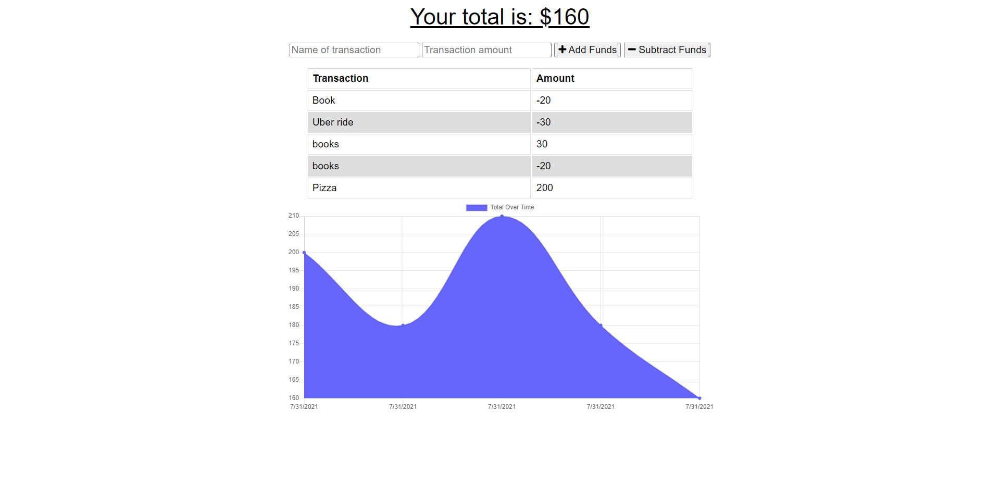

# offline-budget-tracker
## Description
Budget Tracker is a Progressive Web Application utilizes Mongodb to maintain a serverside database of monetary transactions that are sent to a front end application that allows you to display your financial history. A service worker, web manifest, and caching was used to implement offline functionality. As a project, Budget Tracker was a demonstration of converting an application to a PWA.
## Table of Contents
- [Installation](#installation)
- [Usage](#usage)
- [Credits](#credits)
- [License](#license)
## Installation
Deployed Link: https://intense-dusk-28931.herokuapp.com/
## Usage
Screenshots:

## Credits
https://github.com/Randy-chou
## License

## Features
Budget tracker allows you to input and display past financial data. If internet connection is lost, users can continue to use the app. Any data entered while offline is uploaded to the online database upon regaining internet connection.
## How to Contribute
N/A
## Tests
N/A